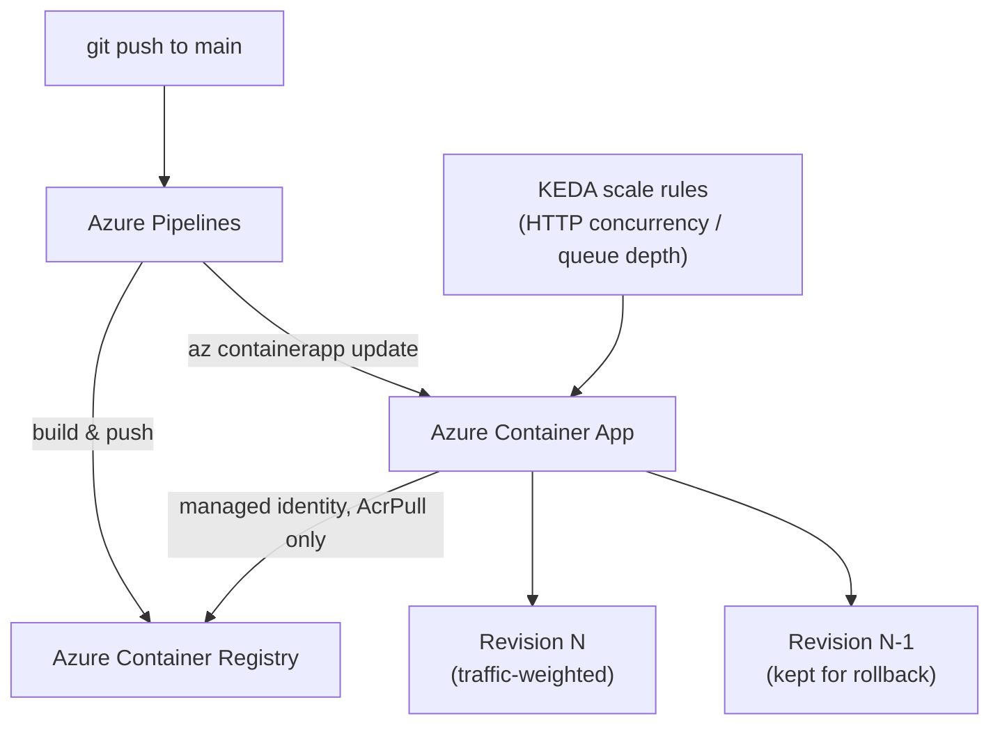

# Azure Container Apps CI/CD Lab

A secure, identity-based Azure Container Registry connection, KEDA-based autoscaling (HTTP concurrency + queue depth), continuous deployment via Azure Pipelines, and safe revision management for zero-downtime rollouts and instant rollback.

Companion lab for the article [Deploying Cloud-Native Apps with Azure Container Apps](https://raphaelgmomoh.pages.dev/articles/azure-container-apps-cicd-and-scaling).

Every `az containerapp` / `az acr` command in this repo was verified against a real, locally installed Azure CLI (`az containerapp --help`) before being committed.

---

## Architecture



---

## Repository Structure

```text
.
├── README.md
├── src/
│   ├── bicep/
│   │   └── main.bicep              # ACR + Container Apps Environment + Container App
│   ├── pipelines/
│   │   └── azure-pipelines.yml     # Build, push, deploy on every push to main
│   └── scripts/
│       ├── setup-acr-identity.sh   # Managed-identity AcrPull connection (no password)
│       ├── configure-scaling.sh    # HTTP + queue-based scale rules
│       └── rollback.sh             # Traffic-weight rollback to a previous revision
```

---

## Quick Start

### 1. Provision the environment (Bicep)

```bash
az deployment group create \
  --resource-group rg-containerapps \
  --template-file src/bicep/main.bicep
```

### 2. Connect the Container App to ACR via managed identity

```bash
./src/scripts/setup-acr-identity.sh rg-containerapps my-containerapp acrcontainerappsdemo
```

### 3. Configure autoscaling

```bash
./src/scripts/configure-scaling.sh rg-containerapps my-containerapp
```

### 4. Wire up CI/CD

Copy `src/pipelines/azure-pipelines.yml` into your repo root, create an `acr-service-connection` and `azure-service-connection` in Azure DevOps, and every push to `main` builds, pushes, and deploys automatically.

### 5. If a deployment misbehaves

```bash
./src/scripts/rollback.sh rg-containerapps my-containerapp
```

---

## License

MIT — use it, fork it, adapt it to your own environment.
